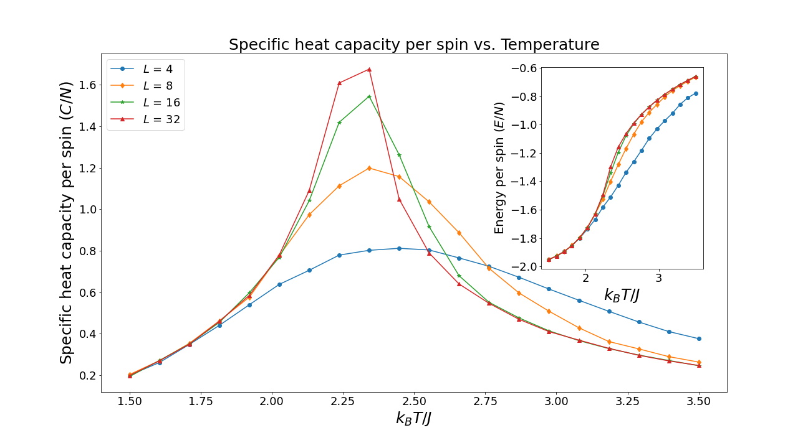
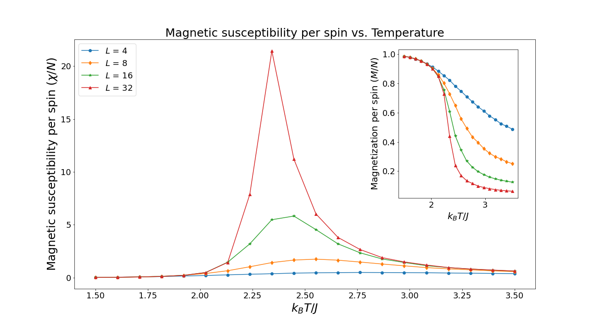
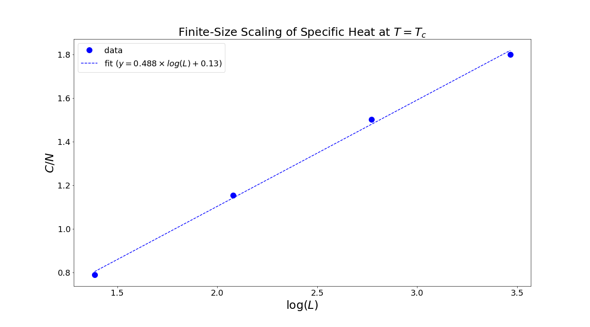

# Ising Model in Two Dimensions

This repository contains Monte-Carlo simulations of Ising model in two dimensions.

The two dimensional Ising model is a model for a magnetic system that has become a de rigeur exercise for any serious compatutional physics student. The model describes classical spins, residing on a L square lattice. Each spin can only take on one of two discrete values, either 1 (spin up) or -1 (spin down). Although very simple to write down, this model shows surprisingly complex behavior and undergoes a phase transition  between a paramagnetic state where the spins are randomly ordered and a ferromagnetic state where the spins all are aligned in the same direction. 

### 1. Specific Heat Capacity

### 2. Magnetic Susceptibility

### 3. Finite-Size Scaling

