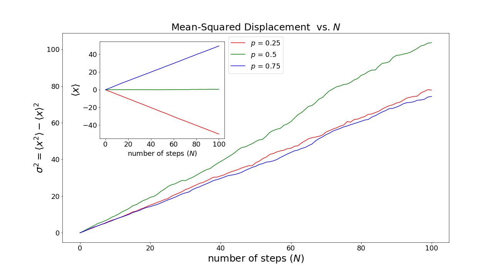
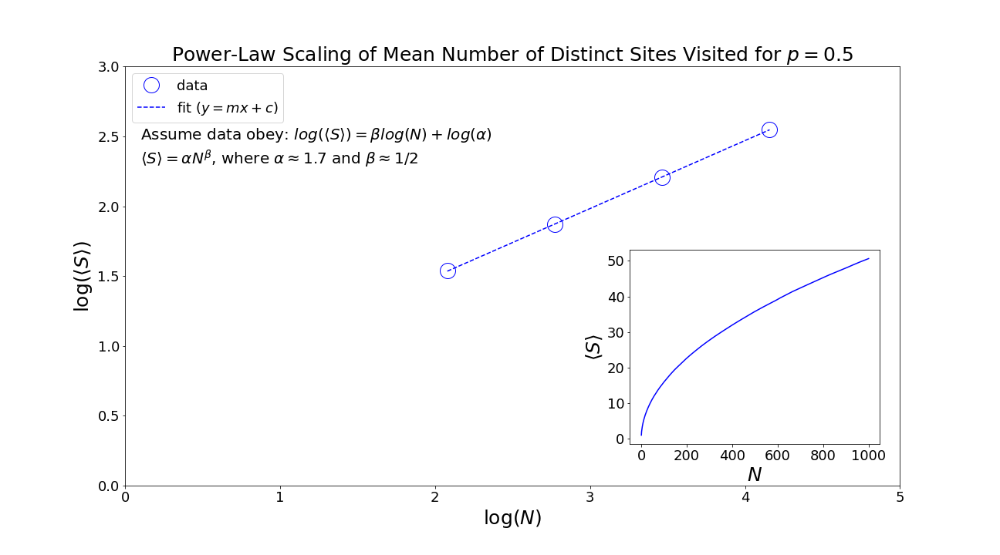
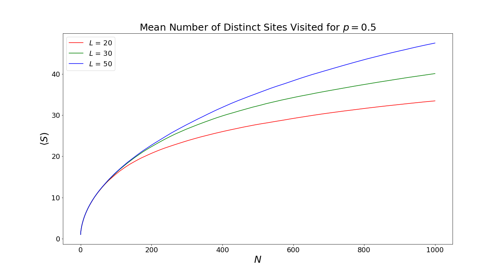

# Random Walks in One Dimension
This repository contains Monte-Carlo simulations of one-dimensional random walks listed below.

1. Random Walk in One Dimension
2. Restricted Random Walk in One Dimension
3. Persistent Random Walk in One Dimension
4. True Self-Avioding Walk in One Dimension
5. Random Walk in One-Dimensional Lattice with Random Traps

## A. Random Walk
In the usual one-dimensional random walk, the random walker can move along a line. Suppose the walker starts at position x = 0 and takes steps of unit length, the probability of stepping to the right is p and the probability of stepping to the left is q = 1-p. 

We would like to obtain the following observables:

- The mean-squared displacement of the walker after N steps.
- The mean number of distinct sites visited during the course of N step walk.
- The probability that the displacement of the walker from the origin is x after N steps.

### A-1. Mean-Squared Displacement

### A-2.  Mean Number of Distinct Sites Visited

### A-3. Probability Distribution

## B. Restricted Random Walk

## B-1. Trap Boundaries
In one-dimensional restricted random walk with trap boundaries, there are trap sites at x = 0 and x = L (L >0). A walker starts from x0 (0 < x0 < L) and takes unit steps to the right with probability p or to the left with probability q = 1-p. When the walker arrives at a trap site, it can no longer move.  The mean number of steps for the walker to be trapped ( the mean first passage time) for p = 1/2 is given by tau = x0(x0 - L)/2D, where D is the self-diffusion coefficient in the absence of the traps, and the average is over all possible walks.

### B-1-1. Gambler's Ruin
Random walk with trap boundaries is related to the gambler's ruin problem. The gambler (walker) starts with x0 dollars and at each step (toss of a coin), the gambler either wins 1 dollar (steps to the right) or losses 1 dollar (steps to the left). The game ends either when the gambler is bankrupt (has x=0 dollar), and is ruined, or the gambler reaches a total of x = L dollars, has won the game.

We would like to obtain the following quantities by Monte Carlo simulation

- The mean number of steps for the walker (gambler) to be trapped (ruined). 
- The probability of the walker (gambler) being trapped (ruined) at x = 0.

### B-1-2. Mean First Passage Time

### B-1-3. Probability of Ruin

## B-2. Reflecting Boundaries
In one-dimensional restricted random walk with reflecting boundaries, there are reflecting sites at x = -L and x = L. A walker starting from x = 0 steps with probability p to the right or q = 1-p to the left. However, when the walker reaches site x = L (x = -L), the next step is reflected to site x = L-1 (x = -L +1).

We would like to obtain the following observables:

- The mean-squared displacement of the walker after N steps.
- The mean number of distinct sites visited during the course of N step walk.
- The probability that the displacement of the walker from the origin is x after N steps.

### B-2-1. Mean-Squared Displacement

### B-2-2.  Mean Number of Distinct Sites Visited

### B-2-3. Probability Distribution

## C. Persistent Random Walk

In persistent random walk, the jump probability depends on the direction of the previous step. Suppose that step N-1 has been made, then step N is made in the same direction with probability p; a step in the opposite direction occurs with probability q = 1-p. The persistent random walk reduces to the usual random walk at p = 1/2.

We would like to obtain the following observables:

- The mean-squared displacement of the walker after N steps.
- The mean number of distinct sites visited during the course of N step walk.
- The probability that the displacement of the walker from the origin is x after N steps.

### C-1. Mean-Squared Displacement

### C-2.  Mean Number of Distinct Sites Visited

### C-3. Probability Distribution

## D. True Self-Avoiding Walk

In one-dimensional true self-avoiding walk, the walker can jump to one of its two nearest neighbors with a probability that depends on the number of times these neighbors have been already visited. 

We would like to obtain the following observables:

- The mean-squared displacement of the walker after N steps.
- The mean number of distinct sites visited during the course of N step walk
- The probability that the displacement of the walker from the origin is x after N steps.

### D-1. Mean-Squared Displacement

### D-2. Mean Number of Distinct Sites Visited

### D-3. Probability Distribution

## E. Random Walk in One-Dimensional Lattice with Random Traps
Consider a one-dimensional lattice L with randomly distributed trap sites. Each lattice site can be in either of two states: with probability rho it is a trap site and with probability 1-rho it is a nontrap site. Suppose a walker is placed at random at any nontrapping site and the walker can step to the right with probability p and to the left with probability 1-p. When the walker arrives at a trap site, it can no longer move.

We would like to obtain the following quantities.

- The mean survival time, that is, the mean number of steps before a trap site is reached.
- The survival probability after N steps, that is, the probability for the walker to survive a given number of steps.

### E-1. Mean Survival Time

### E-2. Mean Survival Probability

