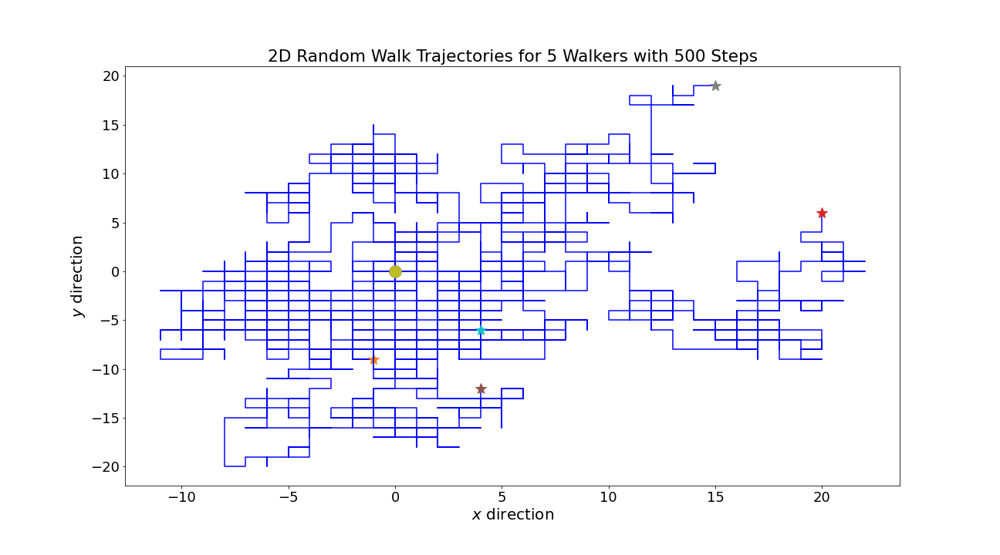
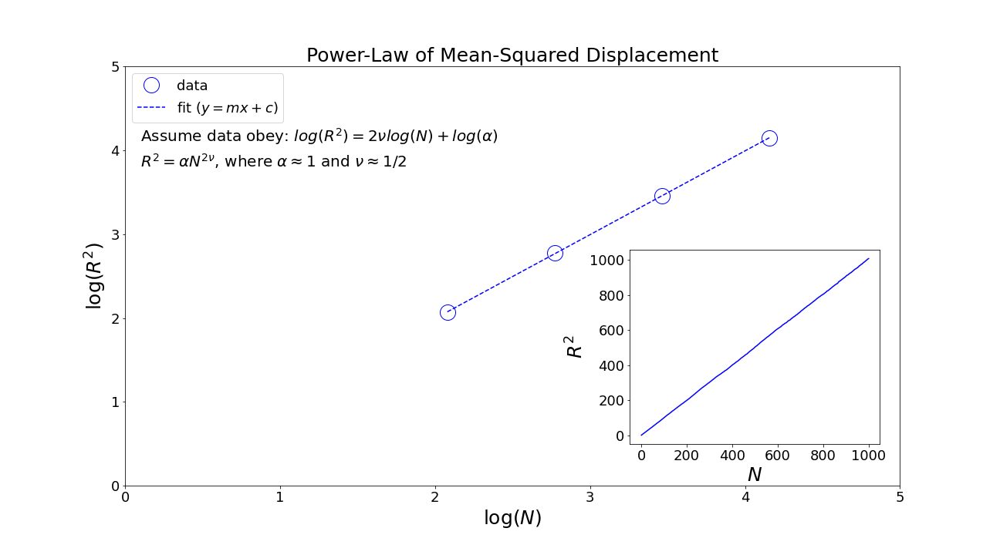
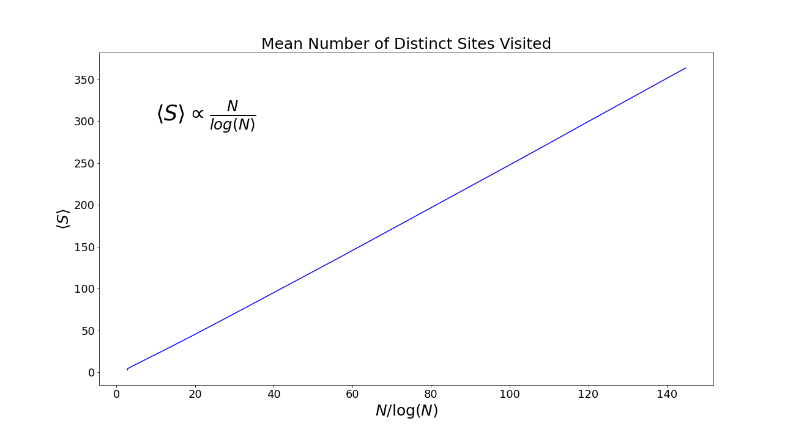

# Random Walk in Two Dimensions

This repository contains Monte-Carlo simulations of two-dimensional random walk.

## A. Two-Dimensional Random Walk
In two-dimensional random walk, the random walkers can move in a 2D grid such as the square lattice. Suppose the walkers start at the center of the grid at position (x,y) = (0,0), the walkers can move at random with equal probability in one of the four directions - north (x, y) = (0,1), south (x, y) = (0,-1), east (x, y) = (1,0), west (x, y) = (-1,0). 

We would like to obtain the following observables:

- The mean-squared displacement of the walkers after N steps.
- The mean number of distinct sites visited during the course of N step walk.

### A-1. Walkers' Trajectories

### A-2. Mean-Squared Displacement

### A-3.  Mean Number of Distinct Sites Visited

